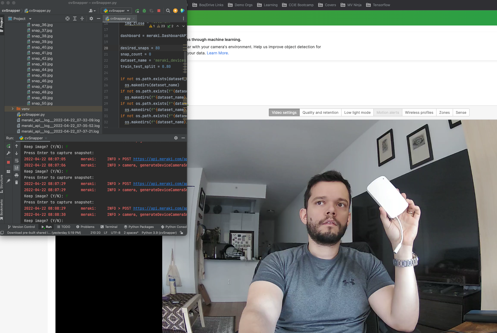
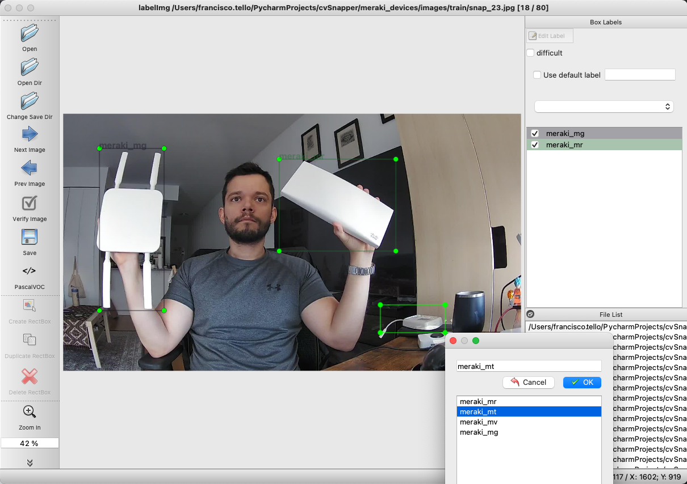

# merakiCustomCvDemo
Capture, Train, Evaluate, Deploy and Demo a Custom CV Model for use with Cisco Meraki MV Cameras from scratch using Python and Google Colab.


#Table of Contents

[Introduction](#intro)
[Prerequisites](#prereq)
[Capturing and preparing the dataset](#capture)
[Training on Google Colab](#train)
[Evaluating on Google Colab](#eval)
[Exporting in TFLite format and deploying on camera](#export)
[Demoing](#demo)

<a name="intro"/>

# Introduction

This tutorial guides you through the process of:

1. Capturing an image dataset using a Meraki MV Camera
2. Training a TensorFlow model on Google Colab from said dataset
3. Evaluating the model
4. Exporting the model to TFLite and deploying it on your camera
5. Using a simple app with TKinter to demo your model

<a name="prereq"/>

## Prerequisites

1. Cisco Meraki MV 2nd Generation Camera (MV2, MV12, MV32, MV22, MV72)
2. Software version 4.18 on the camera
3. A Google account (to be able to use Colab)
4. A laptop with a working installation of Python 3 and Docker
5. A working installation of LabelImg

<a name="capture"/>

## Capturing and preparing the dataset

The first part of the process is capturing images for your dataset. Clone the project to your working directory and navigate to the folder containing the Python scripts.

The first script we will use is `cvSnapper.py`. This script will use a Meraki camera you have in your environment to take snapshots of the objects you want it to learn to identify. Before using it, you must set the following values:

In the `config.py` file:
1. `api_key` is your Meraki Dashboard API Key. If you don't know how to generate one, follow the instructions in this article: https://documentation.meraki.com/General_Administration/Other_Topics/Cisco_Meraki_Dashboard_API
2. `camera_serial`is the serial number of the camera you will be working with
3. `desired_snaps` is the number of snapshots you wish to take to construct your dataset. The more the better, especially if you want to be able to recognize many different classes, but I managed to obtain 75% accuracy with around 100 images
4. `dataset_name` is how you want to name your dataset. I called mine `meraki_devices`
5. `train_test_split` is the percentage of images in the dataset that will be used for training, while the remaining ones will be used for testing

In line `12` of the `cvSnapper.py` script, change the `win_or_mac` variable to `mac` or `win` depending on your environment.

Also, run `pip install -r requirements.txt` to install the required Python libraries before proceeding.

**How large does my dataset need to be?**
* The more, the better, as long as you have roughly the same number of samples for each class. Try to keep the ratio between the most common and least common class below 2 to 1.
* The more classes you have, the more individual samples per class you will need
* As a rule of thumb, you should aim for at least 100 training samples per class if your classes are very different and few, and more than 200 if your classes have similarities between them and you have more than 50 classes
* If your model is to be used in many different settings, you should capture samples that are relevant to all those settings (person samples in a well lit room vs. deploying the model in a dark room)
* The samples you generate should try to place the objects in many different orientations, positions, locations and in the presence of other objects that you want and do not want to detect. It might be worth having samples in which your objects are slightly obscured (their view is partially blocked by a different object)

For more information on recommendations to put your dataset together: https://cloud.google.com/vision/automl/object-detection/docs/prepare



When you're ready and you have positioned the camera you wish to use in the desired location and position, you can run the script with `python cvSnapper.py`. The script will do the following:

1. It will create a directory structure in the form:
```
images
|_train
|_test
```
2. It will prompt you with `Press Enter to capture snapshot:`, and after you press Enter (with no other input), it will generate a Snapshot from the camera you chose. It can be useful to have a Meraki Dashboard video stream of the camera open side by side to know what the camera is looking at before you request the snapshot and make any necessary adjustments.
3. It will then ask you if you want to `Keep image? (Y/N):` . If you answer `Y`, it will increase the snap counter, and save the image as `snap_{snap_count}.jpg` in the `images` folder. 
4. If you answer `N`, it will discard the image and ask you if you wish to continue or not. If you answer `Y`, it will prompt you again to take a new snapshot, and if you answer `N` it will exit the program
5. The script will continue fetching snapshots until the counter reaches your `desired_snaps` setting, and you have the desired number of images.
6. After this, the script will randomly split your captured images according to your specified `train_test_split` and will place them in the `train` and `test` folders.

### Labeling the dataset

For labeling our dataset, we will use an open source tool called LabelImag that you can find in this Github repo: https://github.com/tzutalin/labelImg

Follow the installation instructions for your operating system, and run LabelImg.

1. Click on Open Dir, and navigate to your /images/train folder
2. For every image, draw a bounding box around the object you wish to identify, and give it a class name. This class name MUST be consistent across ALL of the images depicting this object. If an image has more than one object you wish to identify, draw bounding boxes around each of them, and assign a label to each bounding box. Keep your labels consistent!
3. After you draw a bounding box and assign a label, click the button under the `Save` button until it says `PascalVOC`. After this, click Save, which will generate a `.xml` file with the same name as the image in the folder
4. Do this for ALL of your training images
5. After you finish with all of the training images, saving each one, click `Open Dir` and select the `/images/test` folder, and repeat the exact same process



Once you're done labeling, zip the whole `images` folder (including the folder images, not just train and test) into a .zip file.

<a name="train"/>

## Training on Google Colab

<a name="eval"/>

## Evaluating on Google Colab

<a name="export"/>

## Exporting in TFLite format and deploying on camera

<a name="demo"/>

## Demoing
