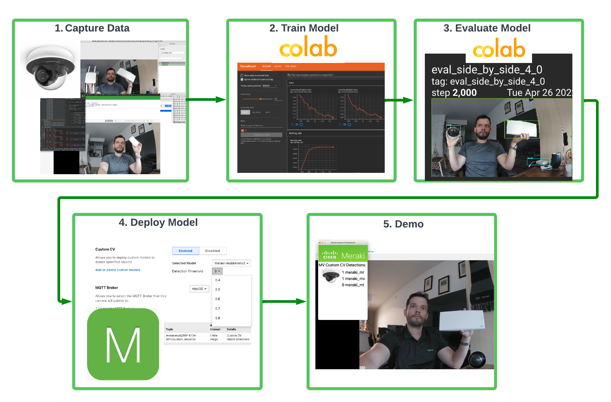

# merakiCustomCvDemo
Capture, Train, Evaluate, Deploy and Demo a Custom CV Model for use with Cisco Meraki MV Cameras from scratch using Python and Google Colab.

##### Table of Contents

[Introduction](#Introduction)
[Prerequisites](#Prerequisites)
[1. Capturing and preparing the dataset](#1. Capturing and preparing the dataset)
[2. Training on Google Colab](#2. Training on Google Colab)
[3. Evaluating on Google Colab](#3. Evaluating on Google Colab)
[4. Exporting in TFLite format and deploying on camera](#4. Exporting in TFLite format and deploying on camera)
[5. Demoing](#5. Demoing)

# Introduction

This tutorial guides you through the process of:

1. Capturing an image dataset using a Meraki MV Camera
2. Training a TensorFlow model on Google Colab from said dataset
3. Evaluating the model
4. Exporting the model to TFLite and deploying it on your camera
5. Using a simple app with TKinter to demo your model

# Prerequisites

1. Cisco Meraki MV 2nd Generation Camera (MV2, MV12, MV32, MV22, MV72)
2. Software version 4.18 on the camera
3. A Google account (to be able to use Colab)
4. A laptop with a working installation of Python 3 and Docker

# 1. Capturing and preparing the dataset

# 2. Training on Google Colab

# 3. Evaluating on Google Colab

# 4. Exporting in TFLite format and deploying on camera

# 5. Demoing
