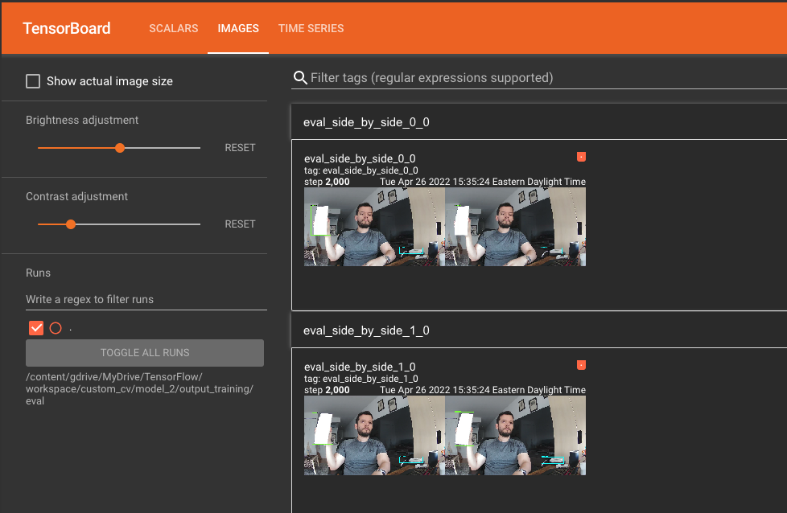

# merakiCustomCvDemo
Capture, Train, Evaluate, Deploy and Demo a Custom CV Model for use with Cisco Meraki MV Cameras from scratch using Python and Google Colab.


#Table of Contents

[Introduction](#intro)
[Prerequisites](#prereq)
[Capturing and preparing the dataset](#capture)
[Training on Google Colab](#train)
[Evaluating on Google Colab](#eval)
[Exporting in TFLite format and deploying on camera](#export)
[Demoing](#demo)

<a name="intro"/>

# Introduction

This tutorial guides you through the process of:

1. Capturing an image dataset using a Meraki MV Camera
2. Training a TensorFlow model on Google Colab from said dataset
3. Evaluating the model
4. Exporting the model to TFLite and deploying it on your camera
5. Using a simple app with TKinter to demo your model

<a name="prereq"/>

## Prerequisites

1. Cisco Meraki MV 2nd Generation Camera (MV2, MV12, MV32, MV22, MV72)
2. Software version 4.18 on the camera
3. A Google account (to be able to use Colab)
4. A laptop with a working installation of Python 3 and Docker
5. A working installation of LabelImg

<a name="capture"/>

## Capturing and preparing the dataset

The first part of the process is capturing images for your dataset. Clone the project to your working directory and navigate to the folder containing the Python scripts.

The first script we will use is `cvSnapper.py`. This script will use a Meraki camera you have in your environment to take snapshots of the objects you want it to learn to identify. Before using it, you must set the following values:

In the `config.py` file:
1. `api_key` is your Meraki Dashboard API Key. If you don't know how to generate one, follow the instructions in this article: https://documentation.meraki.com/General_Administration/Other_Topics/Cisco_Meraki_Dashboard_API
2. `camera_serial`is the serial number of the camera you will be working with
3. `desired_snaps` is the number of snapshots you wish to take to construct your dataset. The more the better, especially if you want to be able to recognize many different classes, but I managed to obtain 75% accuracy with around 100 images
4. `dataset_name` is how you want to name your dataset. I called mine `meraki_devices`
5. `train_test_split` is the percentage of images in the dataset that will be used for training, while the remaining ones will be used for testing

In line `12` of the `cvSnapper.py` script, change the `win_or_mac` variable to `mac` or `win` depending on your environment.

Also, run `pip install -r requirements.txt` to install the required Python libraries before proceeding.

**How large does my dataset need to be?**
* The more, the better, as long as you have roughly the same number of samples for each class. Try to keep the ratio between the most common and least common class below 2 to 1.
* The more classes you have, the more individual samples per class you will need
* As a rule of thumb, you should aim for at least 100 training samples per class if your classes are very different and few, and more than 200 if your classes have similarities between them and you have more than 50 classes
* If your model is to be used in many different settings, you should capture samples that are relevant to all those settings (person samples in a well lit room vs. deploying the model in a dark room)
* The samples you generate should try to place the objects in many different orientations, positions, locations and in the presence of other objects that you want and do not want to detect. It might be worth having samples in which your objects are slightly obscured (their view is partially blocked by a different object)

For more information on recommendations to put your dataset together: https://cloud.google.com/vision/automl/object-detection/docs/prepare


When you're ready and you have positioned the camera you wish to use in the desired location and position, you can run the script with `python cvSnapper.py`. The script will do the following:

1. It will create a directory structure in the form:
```
images/
|_train/
|_test/
```
2. It will prompt you with `Press Enter to capture snapshot:`, and after you press Enter (with no other input), it will generate a Snapshot from the camera you chose. It can be useful to have a Meraki Dashboard video stream of the camera open side by side to know what the camera is looking at before you request the snapshot and make any necessary adjustments.
3. It will then ask you if you want to `Keep image? (Y/N):` . If you answer `Y`, it will increase the snap counter, and save the image as `snap_{snap_count}.jpg` in the `images` folder. 
4. If you answer `N`, it will discard the image and ask you if you wish to continue or not. If you answer `Y`, it will prompt you again to take a new snapshot, and if you answer `N` it will exit the program
5. The script will continue fetching snapshots until the counter reaches your `desired_snaps` setting, and you have the desired number of images.
6. After this, the script will randomly split your captured images according to your specified `train_test_split` and will place them in the `train` and `test` folders.

### Labeling the dataset

For labeling our dataset, we will use an open source tool called LabelImag that you can find in this Github repo: https://github.com/tzutalin/labelImg

Follow the installation instructions for your operating system, and run LabelImg.

1. Click on `Open Dir`, and navigate to your `/images/train` folder
2. For every image, draw a bounding box around the object you wish to identify, and give it a class name. This class name MUST be consistent across ALL of the images depicting this object. If an image has more than one object you wish to identify, draw bounding boxes around each of them, and assign a label to each bounding box. Keep your labels consistent!
3. After you draw a bounding box and assign a label, click the button under the `Save` button until it says `PascalVOC`. After this, click Save, which will generate a `.xml` file with the same name as the image in the folder
4. Do this for ALL of your training images
5. After you finish with all of the training images, saving each one, click `Open Dir` and select the `/images/test` folder, and repeat the exact same process


Once you're done labeling, zip the whole `images` folder (including the folder images, not just train and test) into a .zip file.

<a name="train"/>

## Training on Google Colab

The following sections are performed in Google Colab. Colab is a web based environment where you have access to compute and GPU resources, and can run scripts in the form of Notebooks on demand. It's a nice free alternative for training Machine Learning models without purchasing devices with GPUs or spending a lot on environments like AWS, Google Cloud or Azure using their machine learning resources, and it should work well for prototyping solutions in general. For more professional-grade use cases, you will likely want to leverage paid offerings, or a Meraki ecosystem partner like Cogniac: https://apps.meraki.io/details/cogniac-packaging-kitting

1. Go to https://colab.research.google.com
2. Click on `File`, and select `Upload notebook`
3. Add the `Meraki_TFLite_Demo.ipynb` file from the github repo and click `Open`

Follow the instructions in the Colab Notebook.


<a name="eval"/>

## Evaluating on Google Colab

Follow the instructions in the Colab Notebook as specified in the previous section.



<a name="export"/>

## Exporting in TFLite format and deploying on camera

Follow the instructions in the Colab Notebook until you export the TFLite file. After you export the TFLite file, go to your Google Drive and navigate to the `/content/gdrive/MyDrive/TensorFlow/workspace/custom_cv/{MODEL_NAME}/tflite_models` folder, and download the file. Also download the `label_map.pbtxt` file from your `annotations` folder.

### Visualizing your model

You can visualize the resulting neural network of your TFLite model using the open source Netron app.

1. Open a browser and navigate to https://netron.app
2. Drag and drop your .tflite file into it
3. Click on the very first node in the graph, and on the right you should see information on the inputs and outputs of your model
4. Your `input` should be of type `float32[1,x,y,3]` where the first number is the number of images processed at a time (1), x and y are the height and width of the model (don't worry if these don't match your input source, your model will automatically resize them to fit), and the 4th number is the number of color channels (3 for RGB)
5. Your `outputs` should be exactly 4, all of `type:float32` and their `location` MUST be numbered sequentially (it doesn't matter which 4 numbers, but if the first number is 333, the subsequent numbers must be 334, 335 and 336 in that exact order). If this is not the case, your model will not work with the MV Camera, as it expects the outputs in that specific order. Right now there seems to be an issue with versions of Tensorflow greater than 2.5 when exporting to TFlite, which is why the Notebook prompts you to downgrade to TF 2.5 BEFORE exporting your TFLite model


### Deploying your model

After verifying your model has the appropriate inputs and outputs on Netron:

1. Rename the file to `model.tflite`
2. Zip the file into `model.tflite.zip`, this is very easy to do from the command line with `zip model.tflite.zip model.tflite` and it might be preferable to using a GUI-based ZIP utility as sometimes these add more files into the archive that will give you issues when uploading to the Meraki platform
3. Log into your Meraki Dashboard account, navigate to the camera you wish to test with, go to `Settings - Sense`
4. Click on `Enabled` for the `Sense API` and `Custom CV`, and then select `Add or delete custom models`
5. Upload your `model.tflite.zip` file and give it a meaningful name
6. After it finishes uploading and it says `Ready`, close this popup and assign the model to your camera, and use a low threshold or even 0, we will be using our app to control which detections are plotted and which aren't


<a name="demo"/>

## Demoing

For demoing, we will be using the `mvCustomCvDashboard.py` script.

1. Make sure you have a working Docker installation in your computer and that you have IP connectivity to your camera
2. Run `docker pull ecplipse-mosquitto:1.6` from your terminal, this fetches the image for the Eclipse Mosquitto broker we will be using to receive the messages from our camera
3. Run `docker run -p 1883:1883 eclipse-mosquitto:1.6` from your terminal, this starts the mosquitto broker in your computer, and you should see some console messages in your terminal
4. Go into your Meraki Dashboard and back to the camera you were working on
5. Add a new MQTT Broker from the `Settings - Sense` tab with the IP address of your computer and leave the security settings blank. NOTE: In a production environment, it is highly recommended you use TLS and a user/password to authenticate your clients, but this is out of the scope of this document.
6. Select the MQTT Broker you just added as your camera's broker and click `Save`


Go back to the `config.py` file:
1. Set `max_classes` to the maximum amount of classes you wish your Dashboard to track. The app works well tracking up to 8 classes, otherwise you will run out of space in the Tkinter GUI and you may need to adjust the height and width values.
2. Set `mqtt_server` to `127.0.0.1` (this assumes you're running the script from the same machine you're running the MQTT Broker on)
3. Set `det_threshold` to your preferred value, `0.8` worked well for me, but essentially this will only consider objects your model is at least 0.8 certain of

Add the `label_map.pbtxt` file you downloaded before to your working directory (same level as the scripts), and run `python mvCustomCvDashboard.py`. This will:

1. Connect your script as a client to your broker, which should be receiving the messages from your camera
2. Show a small Tkinter-based GUI that will show the counts of every object your camera recognizes
3. The GUI will only show the first `max_classes` labels your camera identifies, if your model can recognize more labels than this they won't be displayed in the GUI


